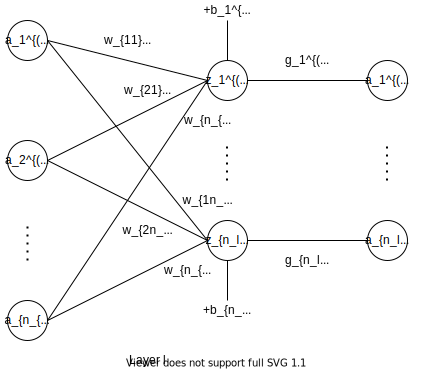

# 多层感知机

## Single Dense Layer

单层全连接层如下图所示：



其中：

- $\boldsymbol{a}^{(l-1)} = (a_1^{(l-1)}, \dots, a_{n_{l-1}}^{(l-1)})^\mathrm{T}$：第 $l-1$ 层的输入向量
- $\boldsymbol{w_i}^{(l)} = (w_{1i}^{(l)}, \dots, w_{n_{l}i}^{(l)})^\mathrm{T}$：第 $l$ 层权重矩阵的第 $i$ 个（列）分量
- $\boldsymbol{b} = (b_1^{(l)}, \dots, b_{n_l}^{(l)})^\mathrm{T}$：第 $l$ 层的偏置向量
- $\boldsymbol{z}^{(l)} = (z_1^{(l)}, \dots, z_{n_l}^{(l)})^\mathrm{T}$：第 $l$ 层的中间输出向量（不考虑激活函数）
- $\boldsymbol{g}^{(l)} = (g_1^{(l)}, g_2^{l}, \dots, g_{n_l}^{(l)})^\mathrm{T}$：第 $l$ 层的激活函数构成的向量函数
- $\boldsymbol{a}^{(l)} = (a_1^{(l)}, \dots, a_{n_{l}}^{(l)})^\mathrm{T}$：第 $l$ 层的输出向量

则

$$
z_i^{(l)} = (\boldsymbol{a}^{l-1})^\mathrm{T} \cdot \boldsymbol{w_i}^{(l)} + b_i^{(l)} \\
\boldsymbol{a}^{(l)} = \boldsymbol{g}^{(l)}(\boldsymbol{z}^{(l)})
$$

记

$$
\mathbf{W}^{(l)} = (\boldsymbol{w_1}^{(l)}, \dots, \boldsymbol{w_{n_l}}^{(l)}) =
\begin{bmatrix}
    w_{11}^{(l)} & w_{12}^{(l)} & \dots & w_{1n_l}^{(l)} \\
    w_{21}^{(l)} & w_{22}^{(l)} & \dots & w_{2n_l}^{(l)} \\
    \vdots & \vdots & \ddots & \vdots \\
    w_{n_{l-1}1}^{(l)} & w_{n_{l-1}2}^{(l)} & \dots & w_{n_{l-1}n_l}^{(l)}
\end{bmatrix}
_{n_{l-1} \times n_l}
$$

则

$$
\boldsymbol{z}^{(l)} = ({\boldsymbol{a}^{(l-1)}}^\mathrm{T} \cdot \mathbf{W}^{(l)} + {\boldsymbol{b}^{(l)}}^\mathrm{T})^\mathrm{T}
$$

上面的数学公式只是每次考虑到输入一个样本（向量） $\boldsymbol{a}^{(l-1)}$，现在我们考虑输入多个样本（矩阵）。

记

$$
\mathbf{A}^{l-1} = (\boldsymbol{a_1}^{(l-1)}, \dots, \boldsymbol{a_m}^{(l-1)})^\mathrm{T} \in \mathbb{R}^{m \times n_{l-1}} \\
\mathbf{Z}^{l} = (\boldsymbol{z_1}^{(l)}, \dots, \boldsymbol{z_m}^{(l)})^\mathrm{T} \in \mathbb{R}^{m \times n_l}
$$

其中 $m$ 为样本的个数，则

$$
\mathbf{Z}^{l} = \mathbf{A}^{l-1} \mathbf{W}^{(l)} + \boldsymbol{1}_{m \times 1} {\boldsymbol{b}^{(l)}}^\mathrm{T}
$$

## 细节

[权重如何初始化](https://medium.com/ai-in-plain-english/weight-initialization-in-neural-network-9b3935192f6)

## 实现

### Numpy

我们需要实现一个全连接的激活为ReLU的网络，它只有一个隐层，没有bias，用于回归预测一个值，loss是计算实际值和预测值的欧氏距离。这里完全使用numpy手动的进行前向和后向计算。numpy数组就是一个n维的数值，它并不知道任何关于深度学习、梯度下降或者计算图的东西，它只是进行数值运算。

```python
import numpy as np

# N是batch size；D_in是输入大小
# H是隐层的大小；D_out是输出大小。
N, D_in, H, D_out = 64, 1000, 100, 10

# 随机产生输入与输出
x = np.random.randn(N, D_in)
y = np.random.randn(N, D_out)

# 随机初始化参数
w1 = np.random.randn(D_in, H)
w2 = np.random.randn(H, D_out)

learning_rate = 1e-6
for t in range(500):
	# 前向计算y
	h = x.dot(w1)
	h_relu = np.maximum(h, 0)
	y_pred = h_relu.dot(w2)
	
	# 计算loss
	loss = np.square(y_pred - y).sum()
	print(t, loss)
	
	# 反向计算梯度 
	grad_y_pred = 2.0 * (y_pred - y)
	grad_w2 = h_relu.T.dot(grad_y_pred)
	grad_h_relu = grad_y_pred.dot(w2.T)
	grad_h = grad_h_relu.copy()
	grad_h[h < 0] = 0
	grad_w1 = x.T.dot(grad_h)
	
	# 更新参数
	w1 -= learning_rate * grad_w1
	w2 -= learning_rate * grad_w2
```

### Tensorflow

### Pytorch

和前面一样，我们还是实现一个全连接的Relu激活的网络，它只有一个隐层并且没有bias。loss是预测与真实值的欧氏距离。之前我们用Numpy实现，自己手动前向计算loss，反向计算梯度。这里还是一样，只不过把numpy数组换成了PyTorch的Tensor。但是使用PyTorch的好处是我们可以利用GPU来加速计算，如果想用GPU计算，我们值需要在创建tensor的时候指定device为gpu。

```python
import torch


dtype = torch.float
device = torch.device("cpu")
# device = torch.device("cuda:0") # 如果想在GPU上运算，把这行注释掉。

N, D_in, H, D_out = 64, 1000, 100, 10

x = torch.randn(N, D_in, device=device, dtype=dtype)
y = torch.randn(N, D_out, device=device, dtype=dtype)

w1 = torch.randn(D_in, H, device=device, dtype=dtype)
w2 = torch.randn(H, D_out, device=device, dtype=dtype)

learning_rate = 1e-6
for t in range(500): 
	h = x.mm(w1)
	h_relu = h.clamp(min=0) # 使用clamp(min=0)来实现ReLU
	y_pred = h_relu.mm(w2)
	
	loss = (y_pred - y).pow(2).sum().item()
	print(t, loss)
	
	grad_y_pred = 2.0 * (y_pred - y)
	grad_w2 = h_relu.t().mm(grad_y_pred)
	grad_h_relu = grad_y_pred.mm(w2.t())
	grad_h = grad_h_relu.clone()
	grad_h[h < 0] = 0
	grad_w1 = x.t().mm(grad_h)
	
	w1 -= learning_rate * grad_w1
	w2 -= learning_rate * grad_w2
```

## 参考资料

- [Deep Dive into Math Behind Deep Networks](https://towardsdatascience.com/https-medium-com-piotr-skalski92-deep-dive-into-deep-networks-math-17660bc376ba)
- [Let’s code a Neural Network in plain NumPy](https://towardsdatascience.com/lets-code-a-neural-network-in-plain-numpy-ae7e74410795)
