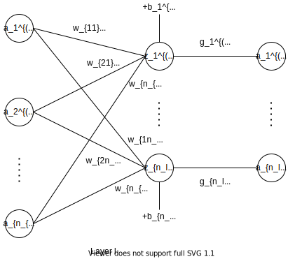
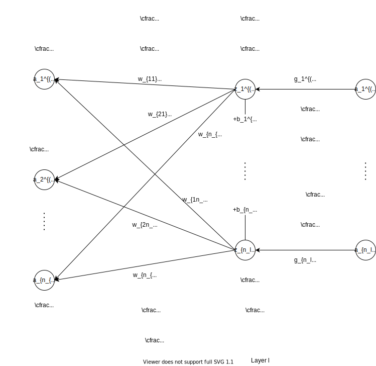

# 传播

这部分主要讲述神经网络的前向传播和后向传播。

## 前向传播

其中：

- $\boldsymbol{a}^{(l-1)} = (a_1^{(l-1)}, \dots, a_{n_{l-1}}^{(l-1)})^\mathrm{T}$：第 $l-1$ 层的输入向量
- $\boldsymbol{w_i}^{(l)} = (w_{1i}^{(l)}, \dots, w_{n_{l}i}^{(l)})^\mathrm{T}$：第 $l$ 层权重矩阵的第 $i$ 个（列）分量
- $\boldsymbol{b} = (b_1^{(l)}, \dots, b_{n_l}^{(l)})^\mathrm{T}$：第 $l$ 层的偏置向量
- $\boldsymbol{z}^{(l)} = (z_1^{(l)}, \dots, z_{n_l}^{(l)})^\mathrm{T}$：第 $l$ 层的中间输出向量（不考虑激活函数）
- $\boldsymbol{g}^{(l)} = (g_1^{(l)}, g_2^{l}, \dots, g_{n_l}^{(l)})^\mathrm{T}$：第 $l$ 层的激活函数构成的向量函数（一个函数作用于一个元素）
- $\boldsymbol{a}^{(l)} = (a_1^{(l)}, \dots, a_{n_{l}}^{(l)})^\mathrm{T}$：第 $l$ 层的输出向量

则

$$
z_i^{(l)} = (\boldsymbol{a}^{l-1})^\mathrm{T} \cdot \boldsymbol{w_i}^{(l)} + b_i^{(l)} \\
\boldsymbol{a}^{(l)} = \boldsymbol{g}^{(l)}(\boldsymbol{z}^{(l)})
$$

记

$$
\mathbf{W}^{(l)} = (\boldsymbol{w_1}^{(l)}, \dots, \boldsymbol{w_{n_l}}^{(l)}) =
\begin{bmatrix}
    w_{11}^{(l)} & w_{12}^{(l)} & \dots & w_{1n_l}^{(l)} \\
    w_{21}^{(l)} & w_{22}^{(l)} & \dots & w_{2n_l}^{(l)} \\
    \vdots & \vdots & \ddots & \vdots \\
    w_{n_{l-1}1}^{(l)} & w_{n_{l-1}2}^{(l)} & \dots & w_{n_{l-1}n_l}^{(l)}
\end{bmatrix}
_{n_{l-1} \times n_l}
$$

则

$$
\boldsymbol{z}^{(l)} = ({\boldsymbol{a}^{(l-1)}}^\mathrm{T} \cdot \mathbf{W}^{(l)})^\mathrm{T} + {\boldsymbol{b}^{(l)}}
$$

上面的数学公式只是每次考虑到输入一个样本（向量） $\boldsymbol{a}^{(l-1)}$，现在我们考虑输入多个样本（矩阵）。

记

$$
\mathbf{A}^{(l-1)} = (\boldsymbol{a_1}^{(l-1)}, \dots, \boldsymbol{a_m}^{(l-1)})^\mathrm{T} \in \mathbb{R}^{m \times n_{l-1}} \\
\mathbf{Z}^{(l)} = (\boldsymbol{z_1}^{(l)}, \dots, \boldsymbol{z_m}^{(l)})^\mathrm{T} \in \mathbb{R}^{m \times n_l} \\
\mathbf{G}^{(l)} = (\underbrace{\boldsymbol{g}^{(l)}, \dots, \boldsymbol{g}^{(l)}}_m)^\mathrm{T} \in \mathbb{R}^{m \times n_l}
$$

其中 $m$ 为样本的个数，则

$$
\mathbf{Z}^{(l)} = \mathbf{A}^{(l-1)} \mathbf{W}^{(l)} + \boldsymbol{1}_{m \times 1} {\boldsymbol{b}^{(l)}}^\mathrm{T} \\
\mathbf{A}^{(l)} = \mathbf{G}^{(l)}(\mathbf{Z}^{(l)})
$$

## 反向传播

一个两层完整的示意图

记网络的参数为 $\boldsymbol{\theta}$，即 $w$ 和 $b$ 等构成的向量，一个样本的损失值为 $l(\boldsymbol{\theta})$，总的损失值为 $L(\boldsymbol{\theta}) = \sum_i^ml(\boldsymbol{\theta})$。

图中节点的值，在前向传播中被计算完成。

下面使用其中某一层作为讲解，讲述如何进行反向传播的求导计算。

感觉下面应该是炸了

先求出 $\boldsymbol{a}^{(l-1)}$ 和 $\boldsymbol{b}^{(l)}$，由

$$
\boldsymbol{z}^{(l)} = ({\boldsymbol{a}^{(l-1)}}^\mathrm{T} \cdot \mathbf{W}^{(l)})^\mathrm{T} + {\boldsymbol{b}^{(l)}}
$$

得

$$
\mathrm{d} \boldsymbol{z}^{(l)} = {\mathbf{W}^{(l)}}^\mathrm{T} \mathrm{d} \boldsymbol{a}^{(l-1)} + \mathrm{d} \boldsymbol{b}^{(l)}
$$

故

$$
\begin{cases}
\cfrac{\partial \mathrm{d} \boldsymbol{z}^{(l)}}{\partial \boldsymbol{a}^{(l-1)}} = \mathbf{W}^{(l)} \\
\cfrac{\partial \mathrm{d} \boldsymbol{z}^{(l)}}{\partial \boldsymbol{b}^{(l)}} = \boldsymbol{1}_{n_l \times 1}
\end{cases} \\
\begin{cases}
    \cfrac{\partial \mathrm{d} l(\boldsymbol{\theta})}{\partial \boldsymbol{a}^{(l-1)}} = \mathbf{W}^{(l)} \\
    \cfrac{\partial \mathrm{d} l(\boldsymbol{\theta})}{\partial \boldsymbol{b}^{(l)}} = \boldsymbol{1}_{n_l \times 1}
\end{cases}
$$

由图可以看出

### 链式求导 + 定义

由链式求导法，可得

$$
\cfrac{\partial L(\boldsymbol{\theta})}{a_{ij}^{(l-1)}} = \sum_{s,t} \cfrac{\partial L(\boldsymbol{\theta})}{z_{st}^{(l)}} \cfrac{\partial z_{st}^{(l)}}{a_{ij}^{(l-1)}}
$$

由

$$
\cfrac{\partial z_{st}^{(l)}}{\partial a_{ij}^{(l-1)}} =
\begin{cases}
    w_{jt}^{(l)} & s = i \\
    0 & s \neq i
\end{cases}
$$

得

$$
\cfrac{\partial L(\boldsymbol{\theta})}{a_{ij}^{(l-1)}} = \sum_{s=i,t} \cfrac{\partial L(\boldsymbol{\theta})}{z_{st}^{(l)}} \cfrac{\partial z_{st}^{(l)}}{a_{ij}^{(l-1)}} = \sum_{t} \cfrac{\partial L(\boldsymbol{\theta})}{\partial z_{i,t}^{(l)}} \cfrac{\partial z_{i,t}^{(l)}}{\partial a_{ij}^{(l-1)}} = \sum_{t} \cfrac{\partial L(\boldsymbol{\theta})}{\partial z_{i,t}^{(l)}} w_{jt}^{(l)}
$$

由于 $\cfrac{\partial L(\boldsymbol{\theta})}{\partial z_{it}^{(l)}}$ 是 $\cfrac{\partial L(\boldsymbol{\theta})}{\partial \mathbf{Z}^{(l)}}$ 的第 $i$ 行，$w_{jt}^{(l)}$ 是 ${\mathbf{W}^{(l)}}^\mathrm{T}$ 的第 $j$ 列，故

$$
\cfrac{\partial L(\boldsymbol{\theta})}{\partial \mathbf{A}^{(l-1)}} = \cfrac{\partial L(\boldsymbol{\theta})}{\partial \mathbf{Z}^{(l)}}{\mathbf{W}^{(l)}}^\mathrm{T}
$$

根据链式法则，有

$$
\cfrac{\partial L}{\partial w_{ij}^{(l)}} = \sum_{s, t}\cfrac{\partial L}{\partial z_{st}^{(l)}} \cfrac{\partial z_{st}^{(l)}}{\partial w_{ij}^{(l)}}
$$

由

$$
\cfrac{\partial z_{st}^{(l)}}{\partial w_{ij}^{(l)}} =
\begin{cases}
    a_{si}^{(l-1)} & t = j \\
    0 & t \neq j
\end{cases}
$$

得

$$
\cfrac{\partial L}{\partial w_{ij}^{(l)}} = \sum_{s,t=j} \cfrac{\partial L}{\partial z_{st}^{(l)}} \cfrac{\partial z_{st}^{(l)}}{\partial w_{ij}^{(l)}} = \sum_{s} \cfrac{\partial L}{\partial z_{sj}^{(l)}} \cfrac{\partial z_{sj}^{l}}{\partial w_{ij}^{(l)}} = \sum_{s}\cfrac{\partial L}{\partial z_{sj}^{(l)}}a_{si}^{(l-1)}
$$

由于 $\cfrac{\partial L}{\partial z_{sj}}$ 是 $\cfrac{\partial L}{\partial \mathbf{Z}^{(l)}}$ 的 第 $j$ 列，$a_{si}^{(l-1)}$ 是 ${\mathbf{A}^{(l-1)}}^\mathrm{T}$ 的第 $i$ 行。

故

$$
\cfrac{\partial L}{\partial \mathbf{W}^{(l)}} = {\mathbf{A}^{(l-1)}}^\mathrm{T} \cfrac{\partial L}{\partial \mathbf{Z}^{(l)}}
$$

根据链式法则，有

$$
\cfrac{\partial L}{\partial b_i^{(l)}} = \sum_{s, t}\cfrac{\partial L}{\partial z_{st}^{(l)}} \cfrac{\partial z_{st}^{(l)}}{\partial b_i^{(l)}}
$$

由

$$
\cfrac{\partial z_{st}^{(l)}}{\partial b_i^{(l)}} =
\begin{cases}
    1 & t = i \\
    0 & t \neq i
\end{cases}
$$

得

$$
\cfrac{\partial L}{\partial b_i^{(l)}} = \sum_{s, t = i}\cfrac{\partial L}{\partial z_{st}^{(l)}} \cfrac{\partial z_{st}^{(l)}}{\partial b_i^{(l)}} = \sum_{s}\cfrac{\partial L}{\partial z_{si}^{(l)}} \cfrac{\partial z_{si}^{(l)}}{\partial b_i^{(l)}} = \sum_{s}\cfrac{\partial L}{\partial z_{si}^{(l)}}
$$

由于 $\cfrac{\partial L}{\partial z_{si}^{(l)}}$ 是 $\cfrac{\partial L}{\partial \mathbf{Z}^{(l)}}$ 的第 $i$ 列，故

$$
\cfrac{\partial L}{\partial \boldsymbol{b}^{(l)}} = (\boldsymbol{1}_{m \times 1}^\mathrm{T} \cfrac{\partial L}{\partial \mathbf{Z}^{(l)}})^\mathrm{T}
$$

## 参考资料

- [神经网络全连接层反向传播公式推导过程](https://zhuanlan.zhihu.com/p/47002393)
- [神经网络BP反向传播算法推导](https://zhuanlan.zhihu.com/p/26765585)